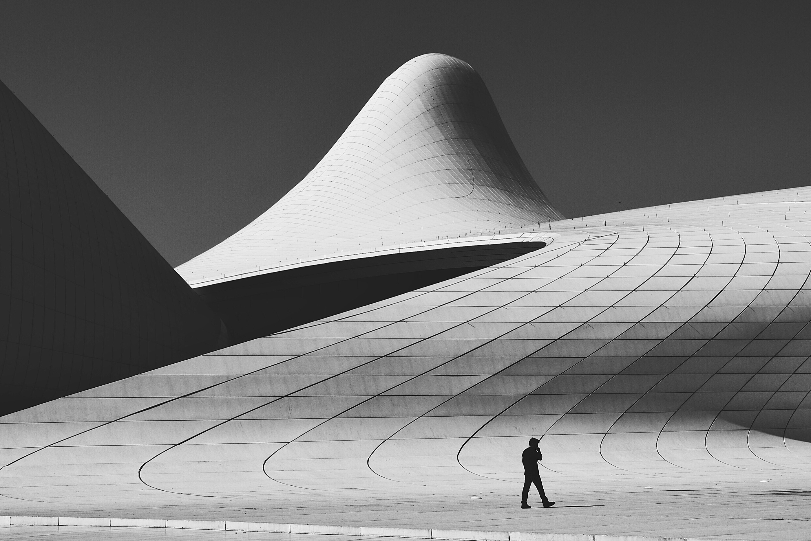

# Oblique

A demonstration website for a fictional architecture practice — *Oblique, architecture, urbanism and research, Zürich · Berlin · Singapore*.

Built as a design exercise: dark, metropolitan, photography-led, with the type and layout system derived from the photographs rather than applied over them.



## Stack

- **Next.js 16** (App Router, Turbopack) — every route prerenders static
- **Tailwind CSS v4** — design tokens declared in `@theme` in `app/globals.css`
- **TypeScript**
- `next/font/google` — Archivo (display), Inter (body), IBM Plex Mono (labels)

## Running it

```bash
npm install
npm run dev      # http://localhost:3000
npm run build    # static prerender of all routes
```

## How it's put together

```
app/
  page.tsx              home — full-bleed hero, index, capabilities, stats
  work/page.tsx         project index + large-format grid
  work/[slug]/page.tsx  project pages, generateStaticParams over lib/projects
  studio/page.tsx       practice narrative, people, history
  contact/page.tsx      enquiry form (no backend wired up)
  globals.css           the whole design system: tokens, type classes, motion
components/
  Photo.tsx             photograph on a dark plate, wiped in on scroll
  IndexList.tsx         the numbered project index
  Reveal.tsx            IntersectionObserver fade-and-lift wrapper
  Parallax.tsx          sub-scroll translate for full-bleed frames
  Counter.tsx           count-up statistics
  Ticker.tsx            discipline marquee
lib/projects.ts         all project content and image assignments
images/                 original photographs, unprocessed
public/images/          web-optimized copies (max 2800px, q78)
```

All copy, project names, people and figures are invented. Everything motion-related
is behind `prefers-reduced-motion`.

## Photography

Photographs are from [Unsplash](https://unsplash.com) and are used under the
Unsplash License. In order of appearance:

Mark Tryapichnikov · Joel Filipe · Rufat Mammadov · Paul Menz · Luke van Zyl ·
Victor · Anders Jildén

The buildings pictured are real works by other architects and are **not** the work
of any practice described on this site.
